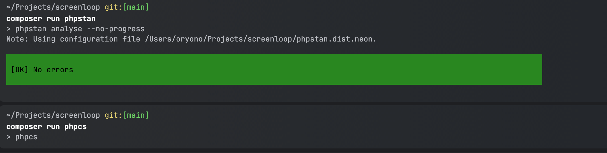
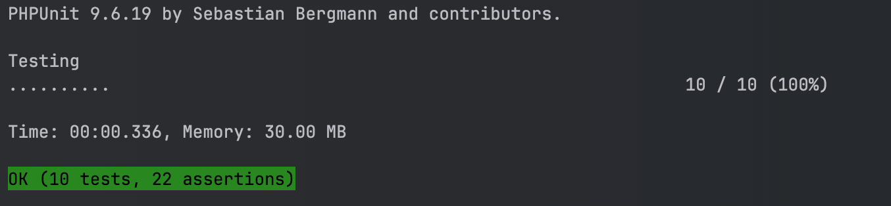

# Symfony 7 Application

## Introduction

This application is built using Symfony 7 and uses JWT (JSON Web Tokens) for authentication. It is configured to use PostgreSQL as the database. This document will guide you through the setup process and provide documentation for the available API endpoints.

## Setup Instructions

### Prerequisites

- Docker
- Docker Compose

### Step 1: Clone the Repository

```bash
git clone git@github.com:oryono/screenloop.git
cd screenloop

```

### Step 2: Build the dependencies and run app
```bash
docker-compose up --build
```

### Step 3: Run migrations and seeders

```bash
./bin/migrate.sh
./bin/seed.sh
```

## Testing
### Step 1: Setup Test database
```bash
bin/setup_test_db.sh
```

### Step 2: Seed database
```bash
bin/seed_test.sh
```

### Step 3: Run tests
```bash
bin/phpunit.sh
composer run phpstan
composer run phpcs
```

### Test results for PHP stan and code sniffer


### PHP Unit test results



## API Documentation
### Authentication
You have to authenticate and get a token to access the product routes. A token must be passed via headers `Authorization: Bearer your_token` to access the routes. Missing authorization header causes a 401 status code
### Login

#### Endpoint: POST `/api/login`
Body
```json
{
  "email": "patrick.oryono@gmail.com",
  "password": "football"
}
```

#### Successful Response
```json
{
  "token": "your_jwt_token"
}
```

#### Failed Response (401)
```json
{
  "message": "Invalid login credentials"
}
```

### Products

#### Endpoint: POST `GET /api/products?page=1&limit=10`
Get paginated list of products

#### Headers
```
Authorization: Bearer your_jwt_token
Accept: application/json
```

#### Successful Response(200)
```json
[
  {
    "id": 1,
    "name": "Product 1",
    "description": "Description of Product 1",
    "price": 100.0,
    "date_of_manufacture": "2023-01-01T00:00:00+00:00",
    "expiry_date": "2024-12-31T00:00:00+00:00",
    "created_at": "2023-01-01T00:00:00+00:00",
    "updated_at": "2023-01-01T00:00:00+00:00"
  },
  ...
]
```

#### Endpoint: GET `GET /api/products/{id}`
Get single product

#### Headers
```
Authorization: Bearer your_jwt_token
Accept: application/json
```

#### Successful Response(200)
```json
{
    "id": 1,
    "name": "Product 1",
    "description": "Description of Product 1",
    "price": 100.0,
    "date_of_manufacture": "2023-01-01T00:00:00+00:00",
    "expiry_date": "2024-12-31T00:00:00+00:00",
    "created_at": "2023-01-01T00:00:00+00:00",
    "updated_at": "2023-01-01T00:00:00+00:00"
}
```

#### Endpoint: POST `POST /api/products`
Create product

#### Headers
```
Authorization: Bearer your_jwt_token
Accept: application/json
```

Body
```json
{
  "name": "product 11",
  "description": "some",
  "price": 10,
  "expiry_date": "2024-10-31",
  "date_of_manufacture": "2024-04-30"
}
```

#### Successful Response (201)
```json
{
    "id": 11,
    "name": "product 11",
    "description": "some",
    "price": 10,
    "expiry_date": "2024-10-31",
    "date_of_manufacture": "2024-04-30"
}
```

### Failed response(400)

```json
{
  "errors": [
    "description": [
      "This value should not be blank"
    ],
    ...
  ]
}
```

#### Endpoint: POST `POST /api/products/{id}/edit`
Update product

#### Headers
```
Authorization: Bearer your_jwt_token
Accept: application/json
```

Body
```json
{
  "description": "some description",
  "date_of_manufacture": "2024-04-30"
}
```

#### Successful Response (200)
```json
{
    "id": 1,
    "name": "product 11",
    "description": "some",
    "price": 10,
    "expiry_date": "2024-10-31",
    "date_of_manufacture": "2024-04-30"
}
```

#### Failed response (400)
```json
{
  "errors": [
    "description": [
      "This value should not be blank"
    ],
    ...
  ]
}
```

#### Endpoint: DELETE `POST /api/products/{id}`
Delete product

#### Headers
```
Authorization: Bearer your_jwt_token
Accept: application/json
```

### Successful request (204)
The response body is empty but the status code is 204

## Notes
- The sh scripts exec into the app container to run commands such as migrating, seeding and phpunit tests in the container and not outside
- I had wanted to implement ci however I could not figure out why tests were failing on CI on time, so i removed it(Commit `15e634421a741a5dab2c88fd3016c8283e5a77d3`). In the future that's an improvement i could make if time allows
- In the future i could implement swagger docs for api documentation. For now I just described the endpoints in the readme
- For phpunit tests, I would have loved to insert data in something like a setup method and then clear it afterwards, but could not figure it out on time. That or a better way to do it could be an improvement i could make in a future version of the codebase
- In the `Product` entity, essentially price column should be a decimal in the database table. In the time i did the assignment i could not get the right type that could trigger the migration to create a decimal.
- I have always been a Laravel developer but had never done symfony framework. I have had to read the docs for this assignment. I still dont know the symfony best practices but with time and more reading, I should get there


